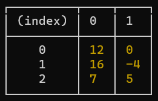

# Find Pairs Exercise
This project contains an efficient algorithm to find pairs in a list of numbers that sum up to a given target.
## Implementation Details
* The main function can be found in `src/findPairs/index.js`. The algorithm has a time complexity of O(n) and a space complexity of O(n).
* Tests for the function are located at: `src/findPairs/findPairs.test.js`

## How To Run The Code
### Prerrequisites
* Ensure you have Node.js version >= 18 installed. If not, download and install it from [Node.js official website](https://nodejs.org/)
### Steps
* Clone the repository.
* Navigate to the root folder of the project using the terminal or command prompt.
* Execute the command: `node index.js <numbers> <target>`.
  * Example: `node index.js 1,9,5,0,20,-4,12,16,7 12`
* Observe the output displayed in a `console.table`. Note: The specific input/output mechanisms are flexible as per the given requirements. 

## How to run the tests
* The tests utilize Node.js's native test runner for simplicity.
* Navigate to the root folder of the project using the terminal or command prompt.
* Execute the command: `node src/findPairs/findPairs.test.js`.
* Review the test results, you should see something like:
